# What's Opening
Flutter based Mobile application for FOAM Maps.  
<t/><t/><t/>  
This application utlizes FOAM contracts and api for POIs and has a second contract on Matic for reporting opening and closing times. Matic has been chosen to reduce onboarding fiction, lesser amount of gas fee can be easily handled with gas stations. Users can check and report opening and closing times without having any foam tokens or eth. 
You can find APKs [here](https://github.com/Abhimanyu121/ColorCoded-FOAM-Maps/releases/tag/V1).

## Traction so Far
This application got featured in Community newsletters of FOAM mentioning how Matic worked charms for UX, you can ping me or FOAM team for a copy of newsletter.  
   
## Video
You can find a small video made by FOAM team demonstrating all the features of the application (some of the features are on Rinkeby and others on Matic). [here](https://vimeo.com/452450616). 
## Reason for making it a mobile app
People usually prefer to check opening and closing times/ places on a mobile app instead of opening a website, and if a Dapp would have been made, it would have had made the ux even more terrible.
## Features
- Check opening and closing time of a POI.
- Submit opening and closing time of a POI.
- Fast and cheap transactions for opening and closing times, thanks to Matic(coverable with gas station).
- Upvote and downvote opening and closing time of a POI.
- Custodial Wallet Services.
- Custodial service can be used to send meta tx or airdrop some eth to minimize user fiction.
- Use of Matic based Contracts
- Adding New POI.
- If user has zero eth, user still can submit opening and closing times(Thanks to Matic layer 2).
- If user has zero FOAM tokens it shows user a link to guide to get started.
- Users can view all POIs , Maps loads dynamically as user moves through map.
- Users can Challenge POIs.
- Users can Access their dashboard and manage FOAM token allowences.
- Users get option to choose not to enter private key stragiht away and is prompted to enter it when it is required.
- Checks to ensure that Users previous transaction is merged.
## Technical Specifications
- Built Using flutter, thus Going Cross platform (Specifcally iOS) is extremely easy.
- Minimal use of native channels thus easier support for different platforms.
- Application Uses Matic for all the extra features to make UX much better.
- FOAM contracts from Rinkeby.
## What is left?
- Adding support for gas station for easier experience and reporting.
- Moving more features on to Matic.
- Polishing and bug fixing in contracts.
- Adding feature to Vote for POI.
- Some bug fixes and exception handling.
- Adding webSockets support dynamic refresh.
## Future Steps
Taking grants from FOAM team and Matic to build a complete decentralized alternative to Google or Apple Maps.
##### Note :- You can use `6843DC59D41289CC20E905180F6702621DCB9798B4413C031F8CB6EF0D9FC3E0` it has FOAM tokens on rinkeby.
##### Note :- Please refrain from entering exceptional values, proper exception handling might not be present everywhere.
##### Note :-If your last transaction is merged by making new transaction still gives you pending transaction, hit the transaction button again.
##### Note :-After adding POI it takes a few minutes so please reopen the app after some time you would see your POI.
## Screenshots
|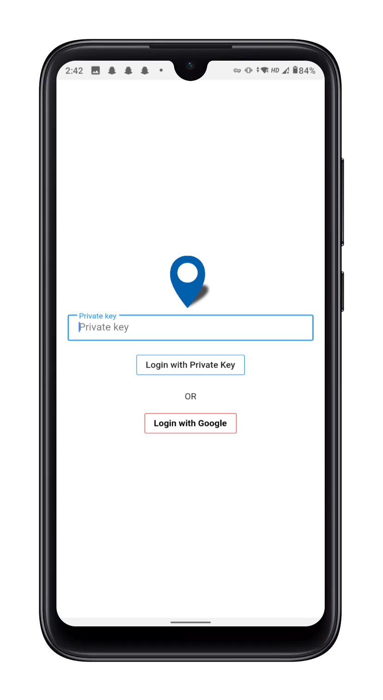|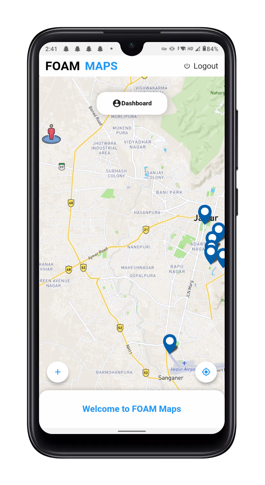
|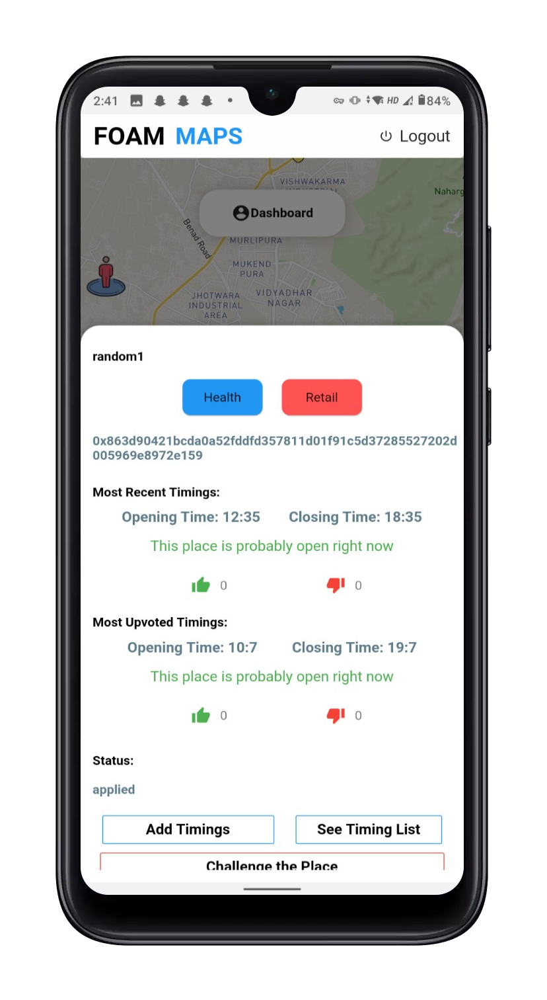|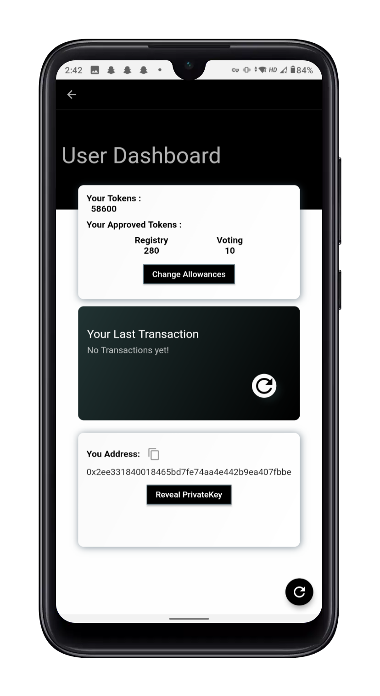
|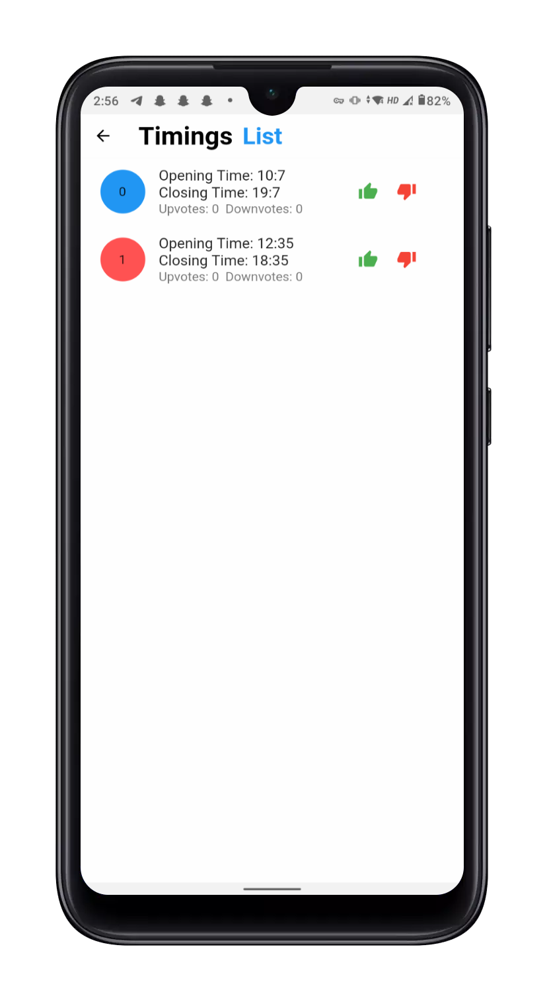|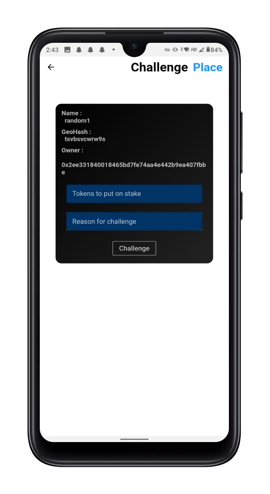
|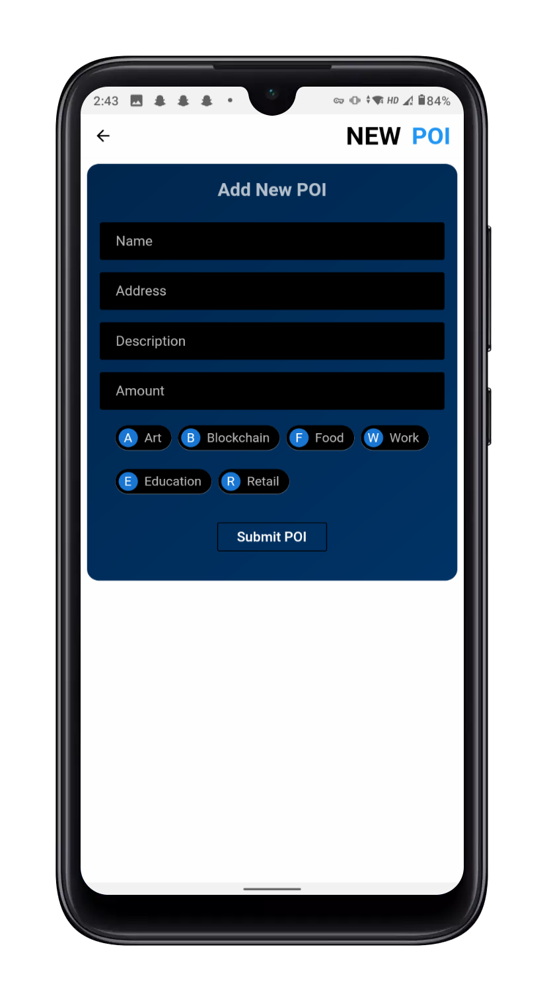|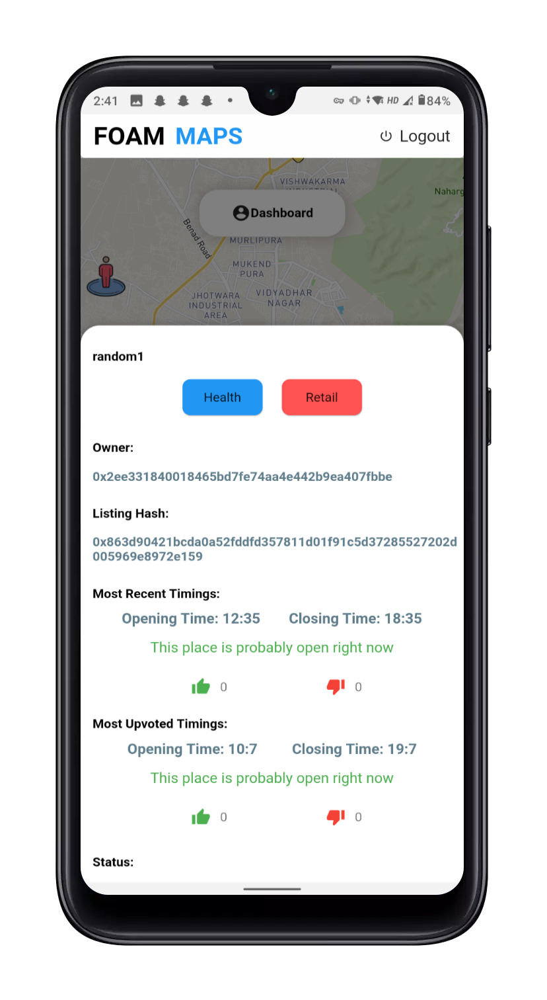
|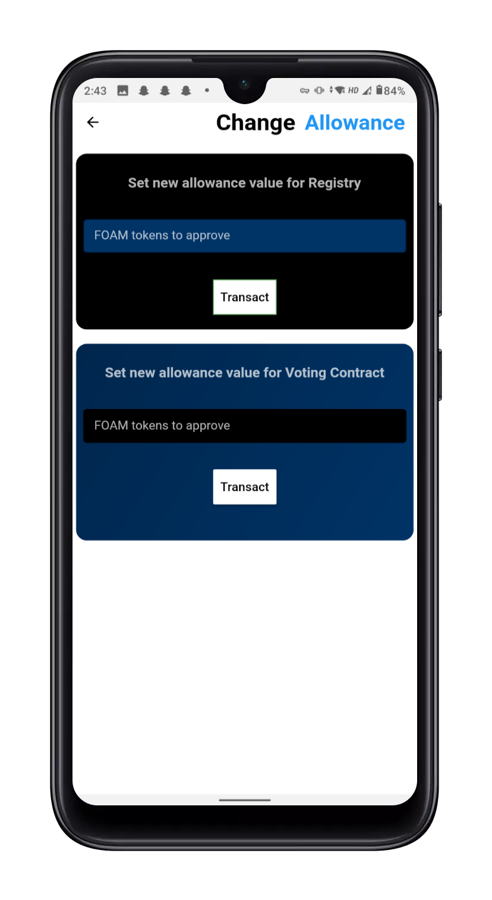|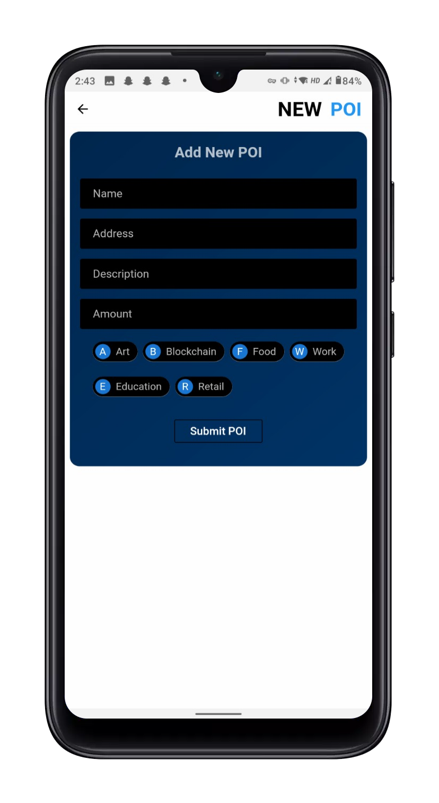
|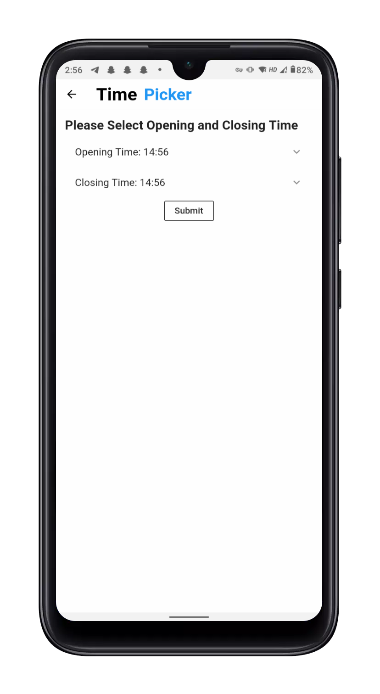|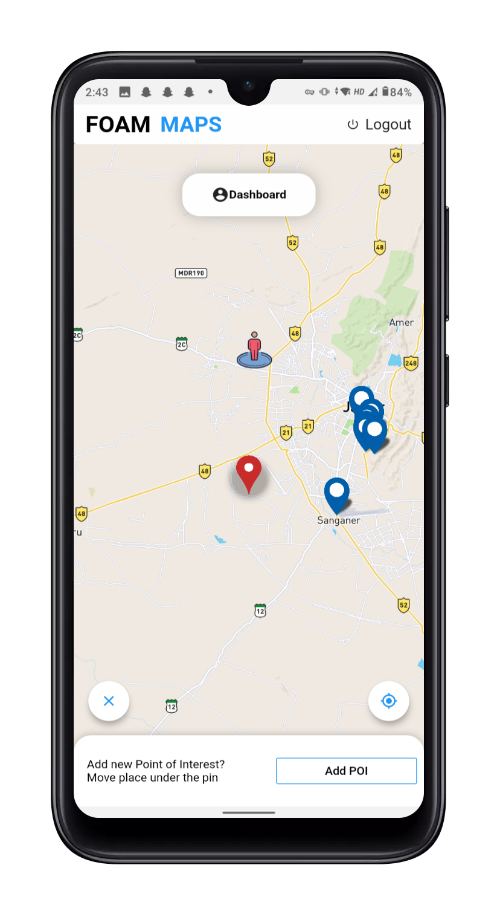
