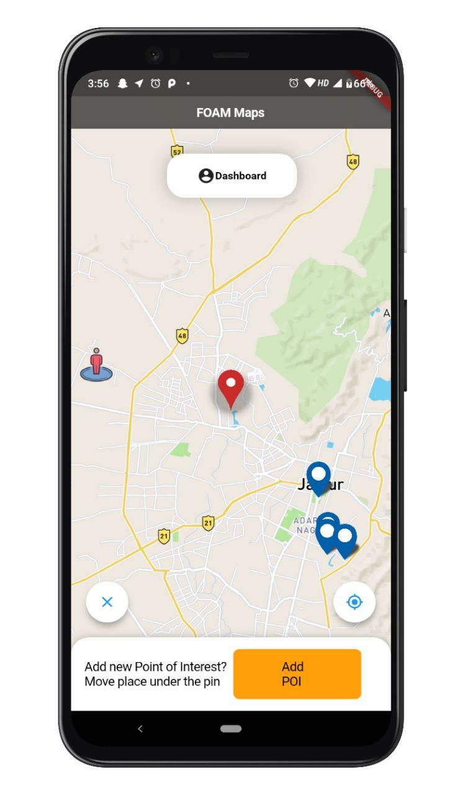
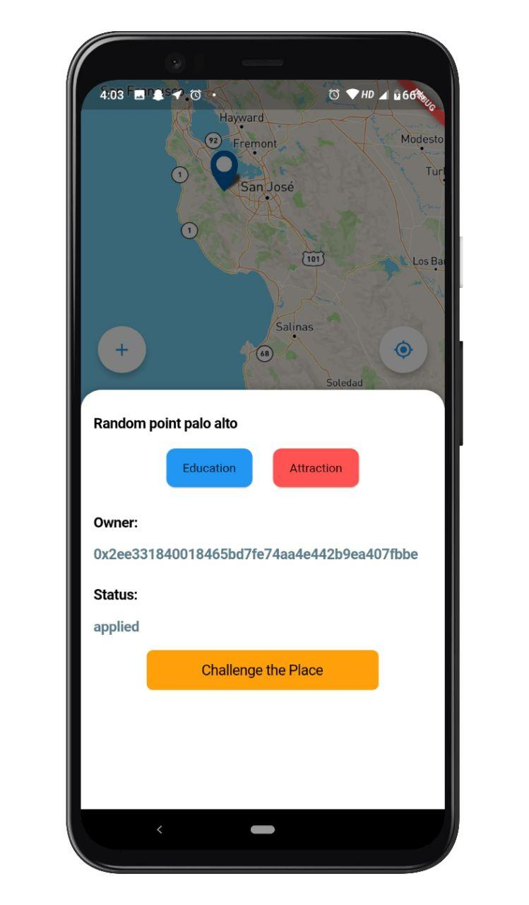
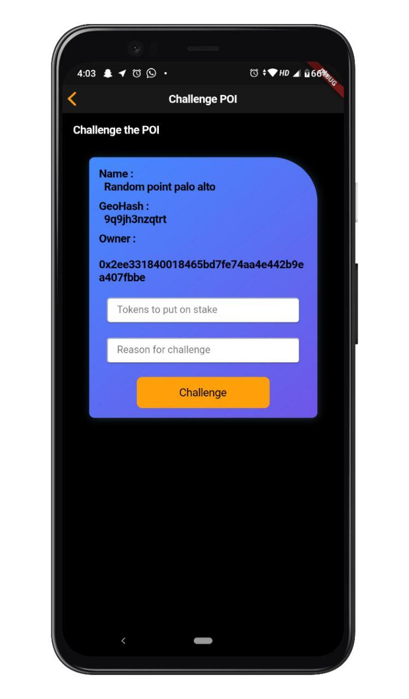
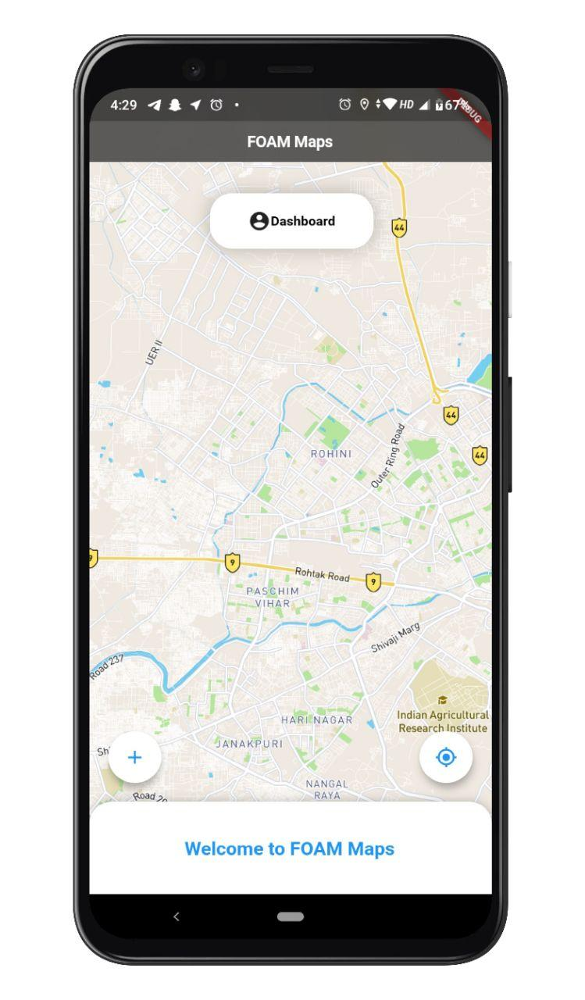
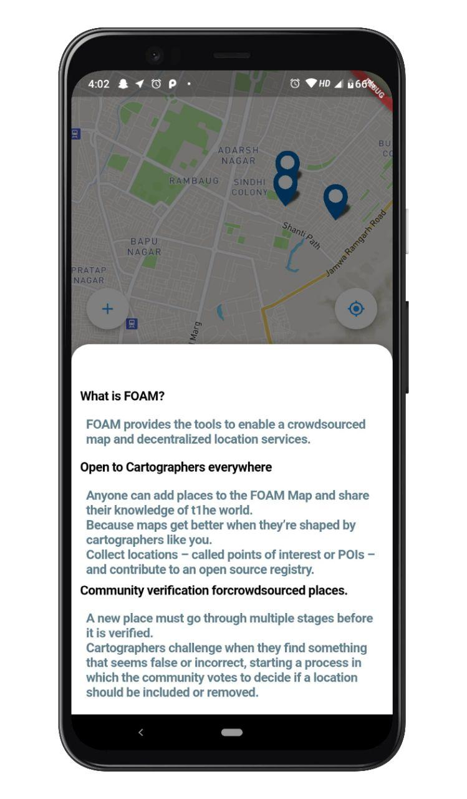
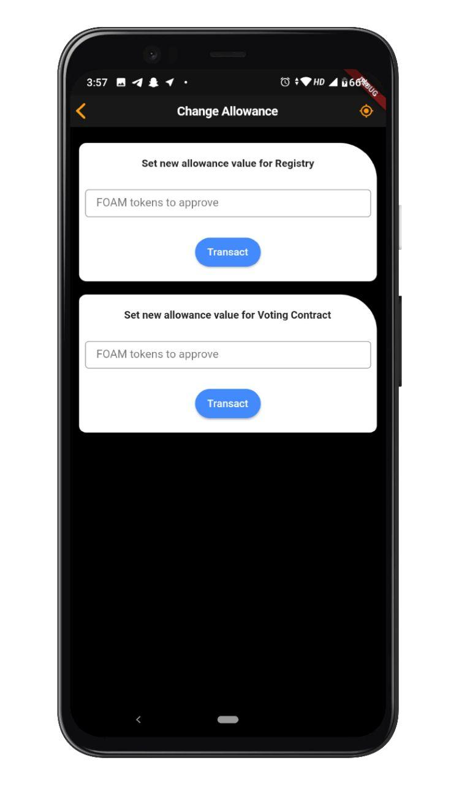
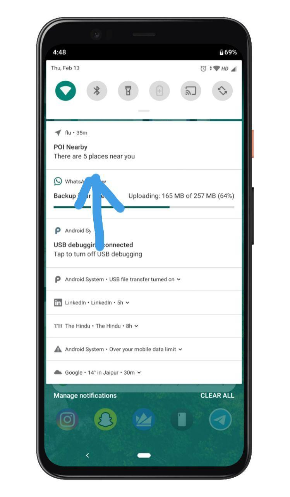
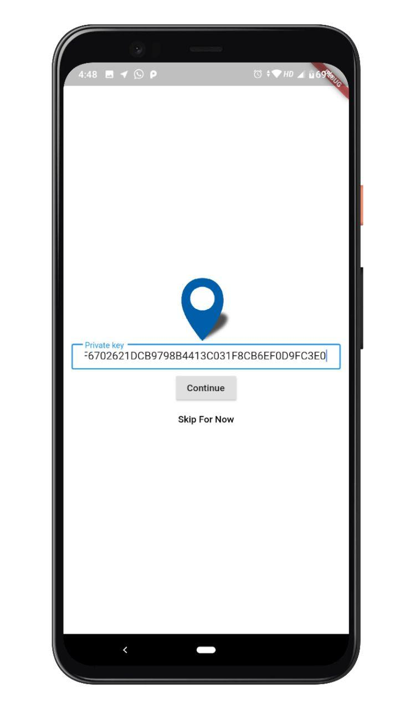

# Foam Maps
Flutter based Mobile application for FOAM Maps.  

## Features
- Users get a notification if they are near any Point of intrest(to keep it battery friendly it checks only if user moves significantly, for testing(111km approx, change of 1 Latitude or 1 Longitude), so create a POI on rinkeby before you initially start app or force stop application and start application again)
- Users can view all POIs , Maps loads dynamically as user moves through map.
- Users can Challenge POIs.
- Users can Access their dashboard and manage FOAM token allowences.
- Users get option to choose not to enter private key stragiht away and is prompted to enter it when it is required.
- Checks to ensure that Users previous transaction is merged.
- Adding New POI(Not exactly sure if it is working properly).
## Technical Specifications
- Built Using flutter, thus Going Cross platform (Specifcally iOS) is extremely easy.
- Minimal use of native channels thus easier support for different platforms.
- Application Uses rinkeby.
## What is left?
- Adding feature to Vote for POI.
- Adding webSockets support dynamic refresh.
##### Note :- You can use `6843DC59D41289CC20E905180F6702621DCB9798B4413C031F8CB6EF0D9FC3E0` it has FOAM tokens on rinkeby.
##### Note :- Proper exceptional handling is not added as of now, please refrain from using exceptional values
##### Note :- Nearby POIs are looked only if user moves, to keep everything light, since distance is about 111km(1 latitude and 1 longitude), you can verify the background service code at [FoamService.kt](https://github.com/Abhimanyu121/foamMap/blob/master/android/app/src/main/kotlin/trellislabs/flu/FoamService.kt) in android module.

## Screenshots
||
||
||
||
||
